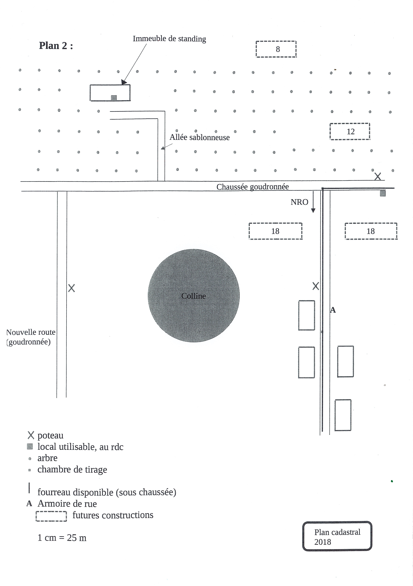

---
Author:
    - Alexis Opolka
    - Mathys Domergue
    - Thibault Garcia
Company: IUT de Béziers
Subject: Cas d'Etude d'installation FO
Copyright: All Rights Reserved

Header:
    Left: Alexis O., Mathys D., Thibault G.
Footer:
    Center: "&copy; {{ ChangeDate 'yyyy' }} {{ Author }} - {{ Copyright }}"
---

# SAE-31 - Un cas d'étude

## Notice

Tout le travail effectué pour la SAE-31 et le projet Vert, que ce soit dans ce document ou sur le dépôt GitHub accessible [ici](https://github.com/alexis-opolka/Vert)
provenant des membres de ce projet est sous [licence MIT](https://mit-license.org/) dont les spécificités sont accessibles [ici](https://github.com/alexis-opolka/import-cours-but-rt/blob/e5afc1845e2027859e05c64fbfe5affc07bdc143/LICENSE).

Dans le cas de travaux ou documents provenant d'autres sources, d'autres entités ou ne provenant pas du travail réalisé par un des membres de ce projet, les droits reviennent à leur auteur.

Pour toute information complémentaire, veuillez me contacter à [copyright@alexis-opolka.dev](mailto:copyright@alexis-opolka.dev).

## Sujet

Ce projet est monté autour de la SAE-301 (aussi appelée SAE-31 sur ce dépôt) dont le PN est accessible [ici](https://github.com/alexis-opolka/vert/blob/main/src/PN-SAE301.pdf),
où le sujet est de faire un cas d'étude sur l'installation d'une desserte fibrée (FO) dans une zone nouvellement constructible en périphérie de la ville de Rouen.

Nous devons principalement faire la desserte d'un [immeuble de standing](https://www.bnppre.fr/glossaire/immeuble-de-standing.html) comportant 7 logements,
en plus de cela, il nous est demandé de préparer le raccordement d'emplacements déjà prévus à la construction afin de faciliter leur futur installation.

## Contexte et Hypothèses de base

### Contexte de base

Comme cité précédemment, nous nous situons en périphérie de [Rouen](https://maps.app.goo.gl/9QaDGt49Um4JFxcUA) dans une zone nouvellement constructible et sommes
dans une zone boisée, nous avons donc décidé de caractériser la zone de construction comme une zone peu dense (soit ZMD ou Zone Moins Dense).

Nous avons, en soit, 4 zones à desservir:

- L'immeuble de standing de 7 logements
- Un site dans une zone boisée de 12 futurs logements
- Un site plus "en haut" du plan cadastral de 8 logements, se trouvant en dehors de la zone boisée
- Deux sites de 18 logements chacun près d'une route déjà construite plus "en bas" du plan cadastral

Ce qui nous fait un total de $7 + 12 + 8 + 18 \times 2 = 63$ logements à desservir.

Nous avons constaté deux défis principaux dans ce contexte.  
Le premier étant de desservir la zone nouvellement constructible dans l'espace boisé et le deuxième se trouve être
de prévoir les futures voies d'accès et les autres raccordements (eau, éléctricité, etc.) pour les zones nouvelles constructibles.

### Hypothèses de base

- #### Des liens aériens

    Nous avons donc décidé de partir sur une majorité de liens aériens.  
    Ils se trouvent être plus susceptibles aux dommages causés par la nature, mais dans notre cas, si l'espace boisé qui les entoure
    ne vient pas à disparaitre sur du court terme, les arbres permettront d'absorber une partie des vents forts et leurs racines
    permettront de stabiliser le sol à proximité des fondations des structures de support rendant ainsi le sol à proximité moins
    vulnérable.

- #### Des raccordements FO ultérieurs ou déjà présents

    Nous avons supposé que la partie des raccordements jusqu'au client serait soit déjà présente ou serait mise en place
    ultérieurement durant, voir après la construction des logements.

    Ceci nous permettant donc de ne pas se concentrer sur les aspects de raccordements au sein d'un batiment et
    plus sur la desserte globale de la zone enlevant par extension des coûts propres à ces installations.

- #### Des raccordements de nécessité déjà préparés

    On considère le raccordement en eau et en électricité des raccordements de `nécessité`,
    ainsi donc, on considère qu'une société à part entière s'est déjà occupé de les effectuer
    ou de préparer les raccordements.

    Ceci nous permettant de nous concentrer seulement sur le raccordement Fibre Optique.

## Une société fictive

Afin d'organiser ce projet (et essayer de l'ammener au plus proche de la réalité), nous avons décidé de créer une société fictive du nom de Vert, inspiré de la
société française [Orange](https://orange.com), sa dénomination tout le long du projet sera `Vert SA` ou `Vert, une Société Anonyme`.

## Auteurs

Ce travail a été effectué et vous est proposé par [Alexis Opolka](https://github.com/alexis-opolka), [Mathys Domergue](https://github.com/Mathys-Domergue)
et [Thibault Garcia](https://github.com/ThibaultGarcia), durant leur cursus de 2ème année de BUT Réseaux et Télécommunications à [l'IUT de Béziers](https://iutbeziers.fr).

## Méthode de travail et gestion de projet

Nous avons décidé de regrouper tout notre travail sur un dépôt GitHub, que vous pouvez retrouver [ici](https://github.com/alexis-opolka/Vert/).  
Pour la gestion de projet, nous avons utilisé un Kaban, disponible sur le GitHub Projects, accessible [via ce lien](https://github.com/users/alexis-opolka/projects/4/views/1).

## Evolution du plan et de ses contraintes

### La première ébauche

En prenant compte de toutes les hypothèses, nous avons fait un premier schéma
de la desserte en fibre optique (FO):

Nous avons rapidement dessiné les besoins de raccordements
en plus de définir le type de liens nécessaires.

### La deuxième ébauche

Après cela, nous avons pris en compte, les besoins au niveau
technique comme physique.

Tel que la longueur maximale qu'un cable de FO peut être tendu
entre deux poteaux, les PM et les PBO afin de pouvoir desservir les logements
en question.

### La dernière ébauche et le rendu final

Enfin, nous avons noté les distances des segments, donné une légende ainsi qu'un
titre au plan.  
Nous avons mis une légende plus détaillée sur les éléments ajoutés et avons
travaillé sur la lisibilité gloable du plan d'installation.

Tout ceci afin de donner le rendu final juste en dessous:

!!!include(./src/choix.md)!!!

!!!include(./src/budget.md)!!!

!!!include(./src/sources.md)!!!
